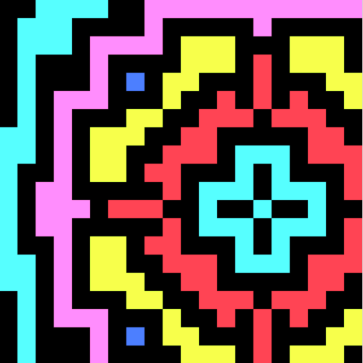

# PLACE CHAAAAAIN

## Setup:
- Run `./setup-go.sh`
- Run `./setup.sh`
- Run `./run-core.sh`
- Run `./run-node.sh`

### Distributed setup

## Description:

Inspired by r/place (last years reddit april prank).

We focus the application around a canvas of size `N x N`. Participants set pixels in a distributed fashion.

The right to set a pixel on the canvas is bought with a crypto coin. The crypto coin we design in this project is called `place-coin`.

When a pixel is set, this is done via a transaction of the blockchain. Painting the picture means traversing back the block chain until a value for a pixel is found.

#### Example

### Architecture

### Participants:

- Arne Beer
- Rafael Epplee
- Hans Ole Hatzel
- Marcel Kamlot
- Felix Ortmann
- Benjamin Warnke

### Core-Features
- set colors of pixels

### Possible Features
- earn coins when you colored them
- Fläche zusammenhängender gleichfarbiger Pixel umfärben (kostet coins aber Mengenrabatt)
- Hintergrundfarbe ändern (kostet extrem viele coins)
- Farbe wechseln kostet extra coins
