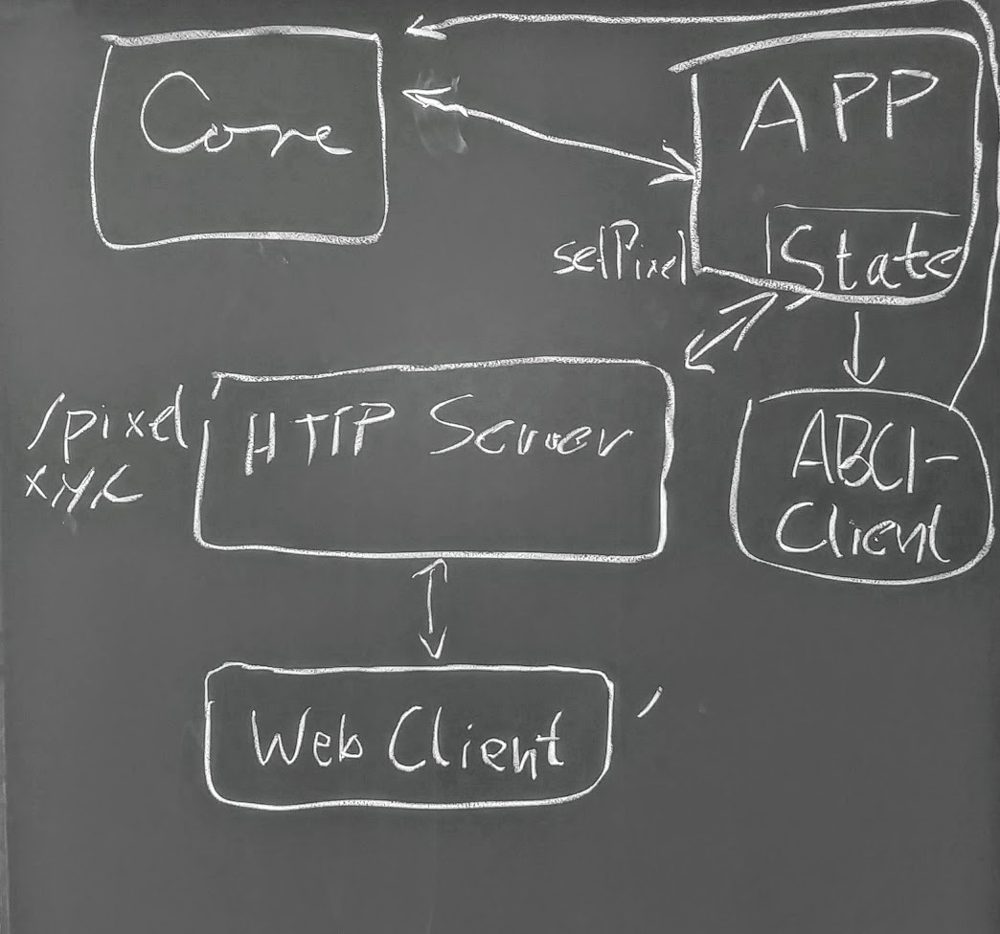

# PLACE CHAAAAAIN

## Setup:
- Run `./setup-go.sh`
- Run `./setup.sh`
- Run `./run-core.sh`
- Run `./run-node.sh`

## Run

Use the commands, find them in `cmd/placechainnode/commands`.

*Setup new node*

    $ go run cmd/placechainnode/main.go init --chain-id my-chain

This will generate a folder in your home directory called `place-chain`, where all needed files for the blockchain are stored.

*Run Full Tendermint Node*

    $ go run cmd/placechainnode/main.go start --full-node

This will start three things:
- A fully fledged tendermint node
- A place-chain application
- A ABCI server

The ABCI server takes inbound connections from the TM node core and dispatches it to our custom place-chain app.

*Run ABCI Server only, that hosts our app*

    $ go run cmd/placechainnode/main.go start

This will only start a ABCI server together with our custom app. Any tendermint core process may then connect to the ABCI server with our app.

### Distributed setup

## Description:

Inspired by r/place (last years reddit april prank).

We focus the application around a canvas of size `N x N`. Participants set pixels in a distributed fashion.

The right to set a pixel on the canvas is bought with a crypto coin. The crypto coin we design in this project is called `place-coin`.

When a pixel is set, this is done via a transaction of the blockchain. Painting the picture means traversing back the block chain until a value for a pixel is found.

#### Example

### Architecture

### Participants:

- Arne Beer
- Rafael Epplee
- Hans Ole Hatzel
- Marcel Kamlot
- Felix Ortmann
- Benjamin Warnke

### Core-Features
- set colors of pixels

### Possible Features
- earn coins when you colored them
- Fläche zusammenhängender gleichfarbiger Pixel umfärben (kostet coins aber Mengenrabatt)
- Hintergrundfarbe ändern (kostet extrem viele coins)
- Farbe wechseln kostet extra coins

### Hausaufgaben
- verteilter Betrieb
- signierte Teilnehmer
- sybil Attacke verhindern